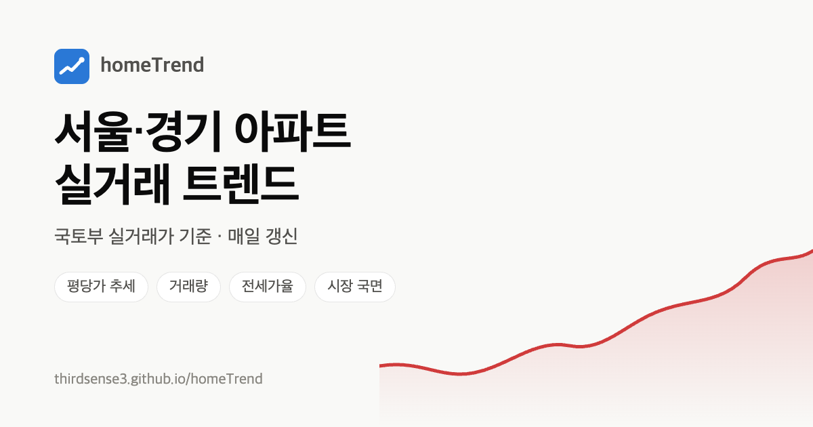

# homeTrend — 서울·경기 아파트 실거래 트렌드

**사이트: https://thirdsense3.github.io/homeTrend/**



국토교통부 실거래가 공개 자료로 서울 25개 구와 경기 26개 시·구의 아파트 시장 흐름을 보여 주는 대시보드예요.
구별 평당가 추세, 거래량, 전세가율, 시장 국면(벌집순환모형)을 한눈에 보고, 관심 있는 단지의 실거래 기록을 차트로 살펴볼 수 있어요.

- 매일 새벽 4시(한국 시간)에 새 자료로 자동 갱신돼요.
- 회원가입이나 로그인이 없고, 관심단지·테마 설정은 내 브라우저에만 저장돼요.

> **꼭 알아두세요.** 이 사이트의 모든 숫자와 국면 판단은 지난 실거래를 정리한 참고 정보예요. 투자 권유나 조언이 아니며, 실제 거래 전에는 매물 시세와 공식 자료를 꼭 따로 확인하세요.

## 이런 걸 볼 수 있어요

- **지역 개요 (서울 / 경기 탭)**
  - 한 줄 요약: 오른 지역과 내린 지역 수, 가장 많이 오른 곳
  - 국면 지도: 가격 변화 × 거래량 위에 각 지역 위치, 6개월·3개월 전부터의 이동 경로
  - 구별 표: 평당가, 3·12개월 변화, 5년 고점 대비, 거래량(장기 평균 대비), 신고가 비율, 전세가율, 국면, 24개월 추세 미니 차트
- **지역 상세**
  - 평당 매매·전세 추이와 월별 거래량을 한 차트로 (1년 / 3년 / 5년 / 전체, 확대 가능)
  - 거래 온도: 신고가·상승·하락 거래 비율
  - 전세가율 추이
  - 전체 거래 / 중개거래만 전환
  - 단지 목록: 최고가 대비 하락폭 등으로 정렬
- **단지 상세**
  - 평형별 매매·전세 실거래 점(신고가 표시) 또는 월봉 차트, 6개월 이동평균, 월별 거래 건수
  - 점을 누르면 그 거래 대비 등락률
  - 1~3층 거래 숨기기, 전세가율·매매-전세 갭, 최근 거래 목록
  - 네이버·호갱노노 검색 바로가기 (매물 호가 확인용)
- **관심단지 (★)** — 별표한 단지 요약, 지난번 확인 뒤 들어온 새 거래·신고가 표시, 주력 평형 평당가 비교 차트
- **금리 · 주택가격 전망 심리** — 한국은행 기준금리, 주택담보대출·전세자금대출 금리, 주택가격전망 CSI
- **편의 기능** — 상단 검색(`/` 키)으로 단지·지역 찾기, 자동 / 라이트 / 다크 테마, 지표 옆 ⓘ에 설명, 모바일에서는 표가 카드 목록으로

## 지역 탐색·관심 지역

상단 `지역 바로가기`에서 구·시를 가나다순으로 선택할 수 있다. 개요 화면에서는 이름 검색, 복수 지역 선택, 좋아요한 지역만 보기로 표·국면 지도·요약을 함께 좁힌다. 지역의 ♥와 단지의 ★는 이 브라우저의 localStorage에 저장되며 다른 기기와 동기화되지 않는다.

검증한 원본 별칭은 16개 대표 단지 카탈로그로 연결한다. 성산시영, 상계주공1·2·10·14단지, 하안주공8단지, 별빛마을9단지와 강선마을 등의 명칭 분리도 포함한다. 원본 명칭은 거래별로 보존한다. 성북구 돈암동 `한신`과 `한진(609-1)`은 `한신한진`으로 표시하고 기존 상세 링크와 관심단지도 연결한다. 지역 지표와 대표 평형은 기존 정수 면적 그룹을 유지한다. 상세 화면의 전용면적은 소수 둘째 자리까지 구분하며 조회 기간에 매매 또는 전세 거래가 있는 면적을 표시한다. 전체 단지의 등록 평형 목록을 의미하지는 않는다. 명칭 점검 결과는 [단지 명칭 점검](docs/complex-name-audit.md)을 참고한다.

개요의 `상승 후보 (실험)`은 현재 가격·거래량·전세 지표를 비교하는 점수다. 5년 급등 확률을 뜻하지 않는다. 계산과 평가 한계는 [점수 설명](docs/candidate-score.md), 과거 시점 평가 도구는 `node scripts/evaluate-candidates.js dist/data 60`을 참고한다.

단기 가격 예측은 지역의 구성 보정 평당가 변화율을 3·6개월 대상으로 학습·검증한다. 개요 표에서 예측값으로 정렬하고 지역 상세에서 기준월·목표월·오차 참고 범위를 확인할 수 있다. 가격 유지 기준보다 오차가 작고 범위 검증도 통과한 기간·지역만 표시한다. 현재 실데이터 검증에서는 3개월 44개 지역이 통과했고, 6개월은 범위 검증 실패로 보류했다. 데모·수집 누락·검증 미달에는 수치를 표시하지 않는다. 방법과 한계는 [단기 가격 예측](docs/short-term-forecast.md)에 기록했다.

## 숫자는 이렇게 계산해요

| 지표 | 계산 |
|---|---|
| 평당가 | 거래가 ÷ (전용면적 ÷ 3.3058). 월 중위값은 점으로 표시해요. 추세선은 비싼 단지 거래가 몰린 달에 값이 튀지 않도록 단지 구성을 보정한 지수의 3개월 이동평균이에요. 수준은 최근 6개 완성월의 실제 중위 흐름에 맞춰요 |
| 일괄 거래 제외 | 같은 단지에서 같은 날 직거래가 10건 이상이면 임대주택 통매각 같은 일괄 거래로 보고 가격·거래량 계산에서 빼요. 거래량 차트에는 노란 막대로 따로 보여요. 전세도 같은 단지·같은 날 10건 이상(공공임대 일괄 계약 등)이면 지역 전세 시세에서 빼요 |
| 고점 대비 | 이동평균 최고점 대비 현재 값. 개요는 최근 5년, 지역 화면은 조회 기간 기준이에요 |
| 거래량 | 최근 3개월 평균을 36개월 중위값(장기 평균)과 비교해요. 직전 3개월 대비도 함께 보여요 |
| 직거래 비율 | 최근 3개 완성월 거래 중 직거래 비중. 가족 간 거래처럼 시세와 동떨어진 거래가 섞일 수 있어서 '중개거래만'으로 볼 수도 있어요 |
| 전세가율 | 최근 6개월 평당 전세 중위 ÷ 평당 매매 중위. 추이 차트는 전세·매매 3개월 이동평균의 비율이에요 |
| 신고가 비율 | 최근 3개 완성월 거래 중 같은 단지·평형의 이전 최고가를 넘은 비중. 상승·하락 비율은 직전 거래와 비교해요. 이전 거래가 없는 거래는 빼고, 조회 시작 후 12개월은 비교 대상이 적어 비워 둬요 |
| 국면 | 가격(3개월 변화) ±1.5%, 거래량(장기 평균 대비) ±15%를 기준으로 벌집순환모형의 6국면으로 나눠요 |
| 이동 경로 | 6개월 전·3개월 전 시점에서 같은 방식으로 계산한 국면 지도 위치 |

가격 지표와 거래량 지표는 모두 **신고가 아직 진행 중인 지난달을 빼고** 계산해요 (아래 '한계' 참고).

## 한계

- **최근 1~2개월은 숫자가 계속 바뀌어요.** 실거래 신고기한이 계약 후 30일이라, 지난달 거래는 아직 다 들어오지 않았어요. 차트에는 "신고 진행 중"으로 표시돼요.
- **매물 호가는 없어요.** 공개 API가 없고 네이버·호갱노노·KB는 자동 수집을 금지하고 있어서, 단지 화면에서 검색 링크만 제공해요.
- **취소된 거래는 빠지지만 늦게 반영될 수 있어요.** 계약 해제가 몇 달 뒤에 신고되기도 해서, 1년 이내 매매는 1주일마다 다시 받아 반영해요.
- **같은 동에 이름이 같은 단지가 있으면 합쳐 보일 수 있어요.** 매매 자료에 단지 고유번호가 없어 동과 단지명으로 단지를 구분해요.
- 화성시는 2026년 일반구 설치로 동탄구·병점구·효행구·만세구로 나뉘어 보여요 (과거 거래도 새 구로 조회돼요).
- 국면 이름과 설명은 일반적인 벌집순환모형을 따른 것이고, 지역마다 실제 시장 상황과 다를 수 있어요.

## 데이터 출처

- 국토교통부 아파트 매매·전월세 실거래가 자료 ([공공데이터포털](https://www.data.go.kr))
- 한국은행 경제통계시스템 [ECOS](https://ecos.bok.or.kr/): 기준금리(722Y001), 예금은행 대출금리 신규취급액 중 주택담보대출·전세자금대출(121Y006), 소비자동향조사 주택가격전망 CSI(511Y002)

---

## 개발자용: 직접 실행하기

의존성 없이 Node 18 이상만 있으면 돼요.

```bash
cp .env.example .env   # MOLIT_API_KEY 입력 (없으면 합성 데모 데이터로 동작)
npm start              # http://localhost:3000
npm test
```

로컬 서버는 10년 이상 기간도 볼 수 있어요 (공개 사이트는 3년 / 5년).

### API 키 발급 (무료)

1. [공공데이터포털](https://www.data.go.kr)에 로그인
2. 아래 두 API를 각각 **활용신청** (자동 승인, 보통 1시간 안에 사용 가능)
   - 국토교통부_아파트 매매 실거래가 자료 (`RTMSDataSvcAptTrade`)
   - 국토교통부_아파트 전월세 실거래가 자료 (`RTMSDataSvcAptRent`)
3. 마이페이지의 **일반 인증키(Decoding)** 를 `.env`의 `MOLIT_API_KEY`에 입력

한국은행 지표(선택): [ECOS Open API](https://ecos.bok.or.kr/api/)에서 회원가입 후 **인증키 신청** → `.env`의 `ECOS_API_KEY`에 입력. 없으면 금리·심리 카드만 빠져요.

API 응답은 (지역 × 월) 단위로 `data/cache/`에 저장돼요. 최근 2개월은 12시간마다, 1년 이내 매매는 1주일마다 다시 받아요.
개발 계정은 일일 호출 한도가 있으니 처음엔 미리 받아 두면 편해요.

```bash
npm run prefetch -- 36 서울   # 서울 전 구, 36개월
npm run prefetch -- 36 경기
```

### 구조

- `lib/molit.js` — 국토부 API 호출(호출 간격 조절·재시도)과 디스크 캐시
- `lib/analyze.js` — 시계열·지표·국면 계산. 서버와 브라우저가 같은 파일을 써요
- `lib/pack.js` — 브라우저로 보내는 지역 원본 데이터 압축 포맷
- `server.js` — 로컬 서버 (`/api/*`)
- `scripts/build.js` — 정적 사이트 빌드 (`dist/`)
- `data/regions.json` — 지역 목록 (코드 추가·수정 가능)

### 배포 (GitHub Pages)

`.github/workflows/deploy.yml`이 매일 04:00(KST)과 main에 push할 때마다 국토부 데이터를 받아 `npm run build`로 정적 사이트를 만들고 Pages에 배포해요.
서버 없이 브라우저가 `data/region/{지역코드}.json`을 받아 직접 계산해요.

- 저장소 Secrets에 `MOLIT_API_KEY`가 필요해요: `grep '^MOLIT_API_KEY=' .env | cut -d= -f2- | gh secret set MOLIT_API_KEY`
- 선택: `ECOS_API_KEY` (`gh secret set ECOS_API_KEY`). 없거나 실패해도 실거래 배포는 그대로 진행돼요
- 받은 원본 데이터는 Actions 캐시에 보관해서 매일 최근 자료만 다시 받아요
- 첫 실행은 5년치 전체라 1~2시간 걸려요. 일일 호출 한도에 걸리면 다음 날 이어 받고, 실패가 5%를 넘으면 이전 사이트를 그대로 둬요

로컬에서 정적 빌드만 확인: `BUILD_MONTHS=36 npm run build` → `dist/`
